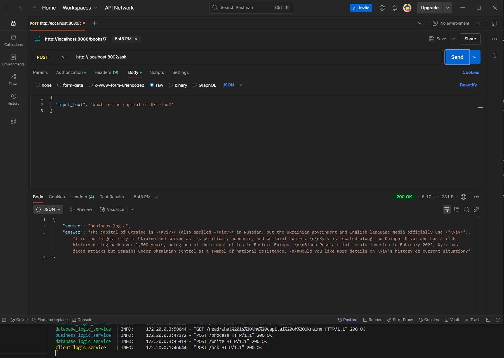
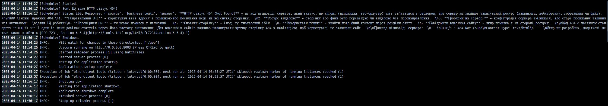
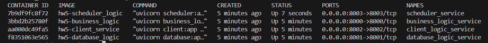
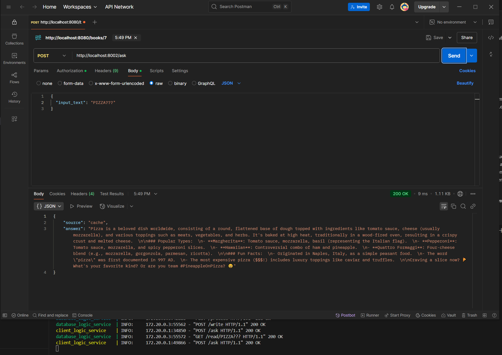

## GitHub : https://github.com/redr1g/hw6/tree/main

## How to run
Go to `https://openrouter.ai/`, log in, create your API key. Place it to business_logic folder in .env file

Then run the following command being in the same directory where **docker-compose.yaml** is located \

`docker compose up`
 
Check 
- `http://localhost:8000/` - for the business logic entrypoints
- `http://localhost:8001/` - for the database entrypoints
- `http://localhost:8002/` - for the customer service logic
- `http://localhost:8003/` - for the scheduler logic

`http://localhost:8002/ask` is the main post request. It asks a question from Deepseek v3-0324.
Your bearer token should be the same in your request as in .env file (**secret_token** for a simpler usage) and have the following json body:

{ \
    "input_text": "What is the capital of Ukraine?" \
}
 
The question is then processed by the client service. If your token is valid, the question is sent to database to check if this question was asked previously. If so, return the answer from cache; send new request (`/process`) to business_logic otherwise. In the end, new question is saved in the db and printed for user (along with the source of answer - cached or business logic).

***Client -> Client Service -> Database -> Business Logic -> Database -> Client***

# Task 1
## 2. Run podman build to create an image of your application.
podman build -t client_service . \
docker build -t client_service .

## 3. Use podman run to run the application container with your image.
podman run -d --name client_service -p 8002:8002 client_service \
docker run -d --name client_service -p 8002:8002 client_service

## 4. Make a test request to your service.

curl -X POST http://localhost:8002/ask \
     -H "Content-Type: application/json" \
     -H "Authorization: Bearer secret_token" \
     -d '{"input_text": "What is the capital of Ukraine?"}'

## 5. Check service logs.
podman logs scheduler_service \
docker logs scheduler_service

## 6. Clean working environment.
podman compose down \
docker compose down

# Task 2
## 3. Create a compose file that describes both of your applications
docker-compose.yaml

## 4. Run podman compose in the directory with compose file and according services.
podman-compose up --build -d \
docker compose up

## 5. Verify both containers started.
podman ps \
docker ps

## 6. Verify that the scheduled container is able to access the main application.
podman logs scheduler_service \
docker logs scheduler_service

## 7. Verify that the main application correctly processes input requests.

curl -X POST http://localhost:8002/ask \
     -H "Authorization: Bearer secret_token" \
     -H "Content-Type: application/json" \
     -d '{"input_text": "PIZZA???"}'

## 8. Do not forget to clean the working environment
podman-compose down \
docker compose down
